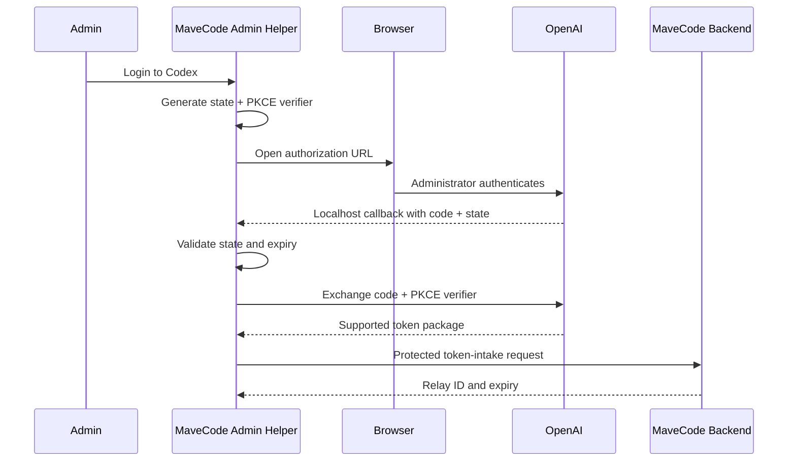
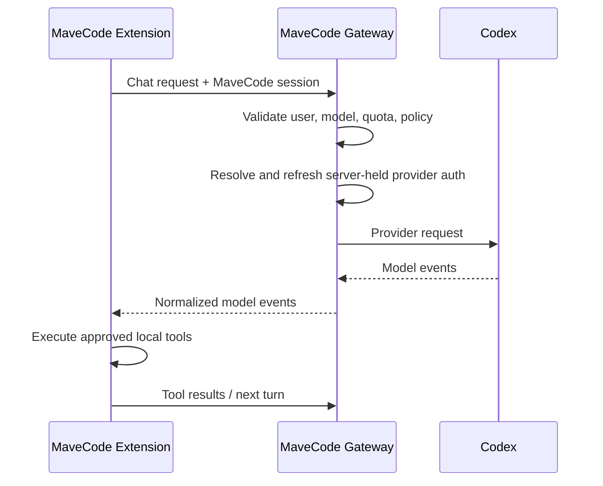

# MaveCode — Universal AI Coding Workspace

## 1. Product Vision

MaveCode is a fork of MaveCode that provides a centrally managed AI coding workspace inside VS Code. A user installs one extension, signs in once, selects **MaveCode** as the AI provider, and immediately receives access to approved models, agents, prompts, rules, and MCP servers without manually entering provider credentials.

The first implementation will reuse and harden the proven Inboxer AI Plus pattern:

1. A trusted local helper performs OpenAI Codex OAuth using the system browser and PKCE.
2. The helper relays the authorized Codex token package to a protected MaveCode backend.
3. Apps Script provides the MVP control plane, user access, configuration, model catalog, and request routing.
4. The MaveCode VS Code extension authenticates with its own MaveCode session—not with raw OpenAI credentials.
5. The extension selects the **MaveCode** provider and uses the backend as its source of AI.

The long-term product should deliver an experience similar to Cursor or GitHub Copilot Enterprise while remaining provider-independent, customizable, and compatible with the inherited MaveCode agent/tool ecosystem.

---

## 2. Core User Experience

```text
Install MaveCode extension
        ↓
Sign in to MaveCode
        ↓
Select “MaveCode” provider
        ↓
Download workspace policy and model catalog
        ↓
Start coding with no API-key configuration
```

### Administrator bootstrap

```text
Install MaveCode Admin Helper
        ↓
Configure protected backend URL
        ↓
Login to Codex in system browser
        ↓
OAuth callback reaches localhost helper
        ↓
Helper exchanges code with PKCE
        ↓
Helper securely relays authorized token package
        ↓
Backend reports MaveCode AI source as ready
```

---

## 3. Objectives

- Zero API-key setup for extension users.
- One MaveCode login across supported computers.
- A visible **MaveCode** option in the API Provider selector.
- Centralized AI-source authorization and lifecycle management.
- No raw provider credentials exposed to extension users.
- Shared agents, prompts, modes, rules, MCP servers, and workspace settings.
- Central usage limits, auditability, and future billing.
- Multiple AI providers behind one stable MaveCode protocol.
- A working Apps Script MVP with a clear migration path to a streaming production gateway.

---

## 4. Core Principles

### 4.1 Credential isolation

The extension must never receive the admin Codex access token, refresh token, browser cookies, provider API key, or helper shared secret.

```text
MaveCode Extension
    │ MaveCode JWT / opaque session
    ▼
MaveCode Backend
    │ server-held provider authorization
    ▼
Codex / future AI provider
```

### 4.2 Login once

After authenticating to MaveCode, a user should receive organization-approved configuration and begin using AI without understanding provider setup.

### 4.3 Provider independence

The extension talks to a stable MaveCode API. Provider routing changes happen behind that API.

Target providers include:

- OpenAI Codex
- OpenAI API models
- Anthropic Claude
- Google Gemini
- NVIDIA NIM
- Ollama
- OpenAI-compatible APIs
- Future providers

### 4.4 Preserve the agent loop locally

File reads, edits, terminal execution, diffs, approvals, MCP tools, and task state remain in the VS Code extension. The backend supplies model inference and centralized workspace data; it does not receive unrestricted control of the developer machine.

### 4.5 Upstream maintainability

MaveCode-specific functionality should be isolated behind typed services and provider adapters so future MaveCode changes can be integrated without repeatedly rewriting core agent logic.

---

## 5. Target Architecture

```text
                       Administrator
                             │
                             ▼
                  MaveCode Admin Helper
                  localhost + OAuth PKCE
                             │
                    protected token intake
                             │
                             ▼
Developer ──► MaveCode VS Code Extension ──► MaveCode Control Plane
                    │                          Apps Script MVP
                    │                               │
                    │                               ├── User sessions
                    │                               ├── Team policy
                    │                               ├── Model catalog
                    │                               ├── Workspace sync
                    │                               └── Usage metadata
                    │
                    └──── chat/tool protocol ───────► AI Request Layer
                                                    │
                                  MVP: Apps Script buffered proxy
                                  Production: streaming gateway
                                                    │
                          ┌─────────────────────────┼──────────────┐
                          ▼                         ▼              ▼
                    OpenAI Codex               NVIDIA NIM       Ollama
```

### Production evolution

```text
MaveCode Extension
      ├── Control/config requests ──► Apps Script / Workspace API
      └── Streaming AI requests ───► Cloud Run or Node AI Gateway
                                           │
                                           ├── Credential vault
                                           ├── Token refresh lock
                                           ├── SSE streaming
                                           ├── Cancellation
                                           ├── Rate limiting
                                           ├── Usage metering
                                           └── Provider routing
```

Apps Script remains useful as a lightweight control plane. It should not remain the permanent high-concurrency streaming data plane.

---

## 6. Components

### 6.1 MaveCode VS Code Extension

Inherited capabilities:

- Chat and task UI
- Agent/tool loop
- File reading and editing
- Terminal commands
- Diff presentation and approval
- MCP client
- Modes, rules, prompts, and context
- Provider/model settings

MaveCode additions:

- **MaveCode** provider entry.
- MaveCode sign-in, sign-out, and session status.
- Secure session storage through VS Code Secret Storage.
- MaveCode model-catalog synchronization.
- Backend availability and entitlement diagnostics.
- Managed workspace synchronization.
- Managed-mode settings that hide direct provider credentials where required.
- Streaming MaveCode backend adapter for the production gateway.

The extension stores only MaveCode session material. It must not store the shared administrator’s Codex credentials.

### 6.2 MaveCode Admin Helper

The helper is based on the Inboxer AI Plus local helper and runs only for an authorized administrator.

Responsibilities:

- Bind localhost services to `127.0.0.1`, not all network interfaces.
- Launch Codex authorization in the system browser.
- Generate and validate OAuth `state`.
- Generate a PKCE verifier and challenge.
- Receive the localhost OAuth callback.
- Exchange the authorization code for the supported token package.
- Extract required account metadata.
- Relay credentials only to the configured protected backend.
- Refresh credentials before expiration when officially supported.
- Show connection, expiry, relay, and backend health status.
- Allow explicit logout and credential revocation.

The helper must not expose a general endpoint that returns raw tokens to arbitrary localhost callers.

### 6.3 Apps Script Control Plane — MVP

Responsibilities:

- Accept authenticated helper token intake.
- Store encrypted or tightly protected provider authorization for the MVP.
- Authenticate extension users.
- Issue short-lived MaveCode extension sessions.
- Return workspace policy and model entitlements.
- Return a model catalog.
- Accept buffered AI requests during the MVP.
- Enforce users, teams, quotas, request size, and model allowlists.
- Record minimal audit and usage metadata.
- Provide health and administrative status.

Apps Script limitations:

- `UrlFetchApp` buffers upstream responses; it does not provide true token-by-token SSE to the extension.
- Execution duration, response size, concurrency, and quotas limit agent workloads.
- Cancellation is weak once a remote fetch starts.
- Script Properties are not a full credential vault.

Therefore Apps Script is the MVP bridge, not the final inference gateway.

### 6.4 Production AI Gateway

Recommended implementation: Node.js with Fastify or NestJS on Cloud Run or equivalent infrastructure.

Responsibilities:

- Provider credential encryption and rotation.
- Access-token refresh with distributed locking.
- Model and capability routing.
- SSE or chunked streaming.
- Cancellation and timeouts.
- Retries with bounded backoff.
- Rate limiting and concurrency control.
- Token and cost accounting.
- Request redaction and structured audit logging.
- Provider error normalization.
- Circuit breaking and health checks.

### 6.5 Workspace API

Stores and synchronizes:

- User settings
- Team and organization membership
- Modes and agents
- Prompts
- Rules
- MCP registry entries
- Model entitlements
- Workspace templates
- Feature flags
- Schema and policy versions

### 6.6 MCP Registry and Agent Marketplace

Users can enable centrally approved integrations and reusable agents without copying configuration manually.

Examples:

- GitHub
- PostgreSQL
- Browser automation
- Jira
- Slack
- Figma
- Notion
- Internal APIs
- Frontend Expert
- Security Auditor
- DevOps
- Database Engineer

---

## 7. Authentication and Session Flows

### 7.1 Administrator Codex bootstrap



### 7.2 Extension user authentication

The extension user authenticates to MaveCode, not directly to the administrator’s Codex account.

Preferred flow:

1. Extension creates a PKCE verifier, challenge, nonce, and state.
2. Extension opens a MaveCode login URL in the system browser.
3. MaveCode authenticates the user through Google, GitHub, Microsoft, or email.
4. Browser returns a one-time authorization code to a VS Code URI callback or loopback callback.
5. Extension exchanges the code and verifier for a short-lived MaveCode access token and rotating refresh token.
6. Tokens are stored in VS Code Secret Storage.
7. Backend session claims identify user, organization, roles, entitlements, and expiry.

Reusable bearer tokens must not be placed directly in callback URLs.

### 7.3 Extension AI request



---

## 8. MaveCode Backend Protocol

The protocol should be versioned from the beginning, for example `/v1/...`.

### 8.1 Health

`GET /v1/health`

Returns:

- Service identity and protocol version.
- Backend availability.
- AI source readiness without exposing credentials.
- Current deployment version.

### 8.2 Authentication

- `POST /v1/auth/authorize`
- `POST /v1/auth/token`
- `POST /v1/auth/refresh`
- `POST /v1/auth/verify`
- `POST /v1/auth/revoke`

### 8.3 Administrator helper

- `POST /v1/admin/provider/token-intake`
- `POST /v1/admin/provider/revoke`
- `GET /v1/admin/provider/status`

All administrator endpoints require strong authentication, replay protection, timestamp validation, nonce tracking, and request signing or an equivalent authenticated channel.

### 8.4 Models

`GET /v1/models`

Each model entry should include:

- Stable ID
- Display name
- Provider family
- Context window
- Output limit
- Image support
- Tool support
- Reasoning support and levels
- Cache support
- Availability and entitlement
- Optional pricing metadata

### 8.5 Chat

`POST /v1/chat/completions` or `POST /v1/responses`

Request capabilities:

- System/developer/user/assistant messages
- Tool definitions
- Tool results
- Images and supported attachments
- Model selection
- Reasoning controls
- Request ID and idempotency key
- Abort/cancellation correlation ID
- Workspace and organization metadata limited to what policy requires

Normalized response events:

- `response.started`
- `response.output_text.delta`
- `response.reasoning.delta` when permitted
- `response.tool_call.created`
- `response.tool_call.arguments.delta`
- `response.usage`
- `response.completed`
- `response.error`

The Apps Script MVP may return the completed response as buffered JSON. The production gateway must stream normalized events.

### 8.6 Workspace synchronization

- `GET /v1/workspace/config`
- `GET /v1/workspace/mcp`
- `GET /v1/workspace/prompts`
- `GET /v1/workspace/rules`
- `POST /v1/workspace/settings`

Responses include schema version, policy version, ETag/revision, and server timestamp for deterministic conflict handling.

---

## 9. Security Requirements

### 9.1 Mandatory controls

- Never ship provider credentials, helper secrets, or production backend secrets in source code.
- Rotate any secret previously committed in a prototype.
- Bind helper servers to loopback only.
- Remove wildcard CORS from helper endpoints.
- Validate `Origin` where browser access is necessary.
- Require unpredictable per-install helper authorization for every mutating localhost request.
- Use PKCE, OAuth state, nonce, and strict callback expiration.
- Do not expose a localhost “return token package” endpoint.
- Do not log authorization headers, access tokens, refresh tokens, cookies, prompts containing secrets, or full source files by default.
- Store extension sessions only in VS Code Secret Storage.
- Encrypt provider credentials at rest with a managed key in production.
- Use short-lived MaveCode access tokens and rotating refresh tokens.
- Hash revocable session identifiers in backend storage.
- Apply user, organization, model, token, and concurrency quotas.
- Add audit events for login, logout, provider relay, credential refresh, policy changes, and administrative access.
- Redact provider errors before returning them to extension users.
- Reject stale timestamps, reused nonces, and duplicate token-intake requests.

### 9.2 Trust boundaries

| Component          | May access                                                       | Must not access                                      |
| ------------------ | ---------------------------------------------------------------- | ---------------------------------------------------- |
| VS Code extension  | MaveCode user session, model catalog, workspace policy           | Admin Codex credentials, helper shared secret        |
| Admin helper       | Admin OAuth package, protected backend intake credentials        | Other users’ source code and sessions                |
| Apps Script MVP    | User/control data and temporary protected provider authorization | Local filesystem or unrestricted extension tools     |
| Production gateway | Encrypted provider authorization and normalized AI requests      | Unnecessary repository data or local machine control |

### 9.3 Provider authorization review

Before production deployment, verify that the chosen OpenAI/Codex authorization flow and account usage comply with current provider terms, supported OAuth clients, account-sharing rules, quotas, and permitted runtime endpoints. If the helper flow is not officially supported for the intended multi-user use, replace it with official OpenAI API/project credentials or a supported per-user authorization flow.

---

## 10. Data Model

Minimum entities:

- `User`
- `Organization`
- `Membership`
- `ExtensionSession`
- `ProviderConnection`
- `ModelEntitlement`
- `WorkspaceConfig`
- `Prompt`
- `RuleSet`
- `Mode`
- `McpRegistration`
- `UsageEvent`
- `AuditEvent`

Provider tokens are not normal user settings. They require a separate encrypted credential record with key version, provider account, creation time, expiry, last refresh, last use, and revocation status.

---

## 11. Error Handling and Resilience

The extension and backend must normalize these conditions:

- Helper unavailable
- Admin provider not connected
- MaveCode user not authenticated
- Expired MaveCode session
- Expired provider authorization
- Provider refresh failure
- User not entitled to model
- Quota or rate limit exceeded
- Backend timeout
- Provider timeout
- Malformed provider stream
- Request cancelled
- Apps Script quota exceeded
- Workspace configuration conflict

Rules:

- Retry only idempotent or safely replayable operations.
- Use bounded exponential backoff with jitter.
- Do not retry authentication failures automatically without refresh/re-authentication.
- Use idempotency keys to prevent duplicate model requests.
- Preserve request IDs across extension, gateway, and provider logs.
- Return actionable, redacted error messages.

---

## 12. Development Roadmap

### Phase 0 — Fork foundation

- Maintain the complete MaveCode source inside `MaveCode/`.
- Establish MaveCode package, extension, command, configuration, and provider identities.
- Preserve upstream attribution and compatible package namespaces.
- Keep type checks and inherited tests passing.

Exit criteria:

- Extension builds as a separate MaveCode identity.
- MaveCode appears in user-facing surfaces.
- Workspace type checks pass.

### Phase 1 — Inboxer-pattern proof of concept

- Fork the Inboxer helper into MaveCode Admin Helper.
- Remove committed secrets and insecure token-return endpoints.
- Implement Codex OAuth with PKCE and strict state validation.
- Build protected Apps Script `token-intake`, `health`, and `models` actions.
- Add MaveCode provider to the extension dropdown.
- Connect the MaveCode provider to a buffered Apps Script chat action.
- Support text-only conversations first.

Exit criteria:

- Admin can connect the AI source through the helper.
- Extension user can sign in and select MaveCode.
- Extension can complete a multi-turn text request without seeing provider credentials.
- Logout and provider revocation work.

### Phase 2 — Agent compatibility

- Support complete conversation history.
- Support tool definitions and tool results.
- Support reasoning configuration and usage metadata.
- Support images and safe attachment limits.
- Add cancellation correlation and request idempotency.
- Add model catalog capabilities and entitlements.
- Add focused provider, auth, and protocol tests.

Exit criteria:

- MaveCode can run the inherited agent loop through its provider.
- File and terminal tools continue to execute locally with normal approvals.
- Tool-call and usage events round-trip correctly.

### Phase 3 — Production streaming gateway

- Deploy a Node/Fastify or NestJS gateway.
- Move provider credentials from Apps Script to encrypted storage.
- Add SSE streaming and cancellation.
- Add refresh locking, retries, circuit breaking, and rate limits.
- Keep Apps Script as control plane or migrate control APIs to the Workspace API.
- Add structured logs, metrics, and alerting.

Exit criteria:

- First-token latency and streaming behavior are suitable for interactive coding.
- Concurrent refresh cannot corrupt provider sessions.
- No provider credential appears in client traffic or logs.

### Phase 4 — Workspace collaboration

- Shared prompts
- Shared rules
- Shared modes and agents
- MCP registry
- Workspace templates
- Team memory with explicit retention controls
- Organization administration
- Usage dashboard

### Phase 5 — Commercial and enterprise platform

- Billing
- Marketplace
- SSO/SAML/OIDC
- SCIM
- Audit export
- Data residency controls
- Customer-managed keys
- Private gateway deployment
- Cloud workspaces and remote development

---

## 13. Testing Strategy

### Extension tests

- MaveCode provider appears and persists correctly.
- Managed users cannot accidentally expose provider secrets.
- Login, refresh, verify, logout, and revoked-session states.
- Model catalog loading and fallback behavior.
- Chat request serialization.
- Stream event parsing.
- Tool calls and tool results.
- Cancellation and retries.
- Secret redaction.

### Helper tests

- PKCE verifier/challenge generation.
- OAuth state mismatch and expiry rejection.
- Callback port collision.
- Loopback-only binding.
- Signed token-intake requests.
- Backend allowlist enforcement.
- Logout and in-memory credential clearing.
- No endpoint returns raw tokens to untrusted callers.

### Backend tests

- Authentication and role authorization.
- Nonce replay rejection.
- Token-intake encryption and rotation.
- Provider expiry and refresh.
- Concurrent refresh locking.
- Model entitlement enforcement.
- Quotas and rate limits.
- Buffered response parsing for Apps Script.
- SSE framing for production gateway.
- Provider error redaction.

### End-to-end tests

1. Connect provider through helper.
2. Sign in from extension.
3. Select MaveCode provider.
4. Load models.
5. Send a chat request.
6. Execute an approved local tool.
7. Return tool result and complete the task.
8. Revoke the provider and verify new requests fail safely.

---

## 14. Deployment and Operations

### Environments

- Local development
- Shared development
- Staging
- Production

Each environment must use separate OAuth configuration, backend URLs, signing keys, encryption keys, provider connections, databases, and Apps Script deployments.

### Observability

Track:

- Authentication success/failure
- Provider connection readiness
- Token refresh success/failure
- Requests by model and organization
- First-token and total latency
- Input/output token usage
- Rate-limit events
- Apps Script quota failures
- Gateway errors by normalized code
- Cancellation rate
- Tool-loop completion rate

Never include raw credentials or unrestricted prompt/source contents in telemetry.

### Rollback

- Version all backend protocols.
- Keep extension compatibility with at least one previous protocol version during rollout.
- Use feature flags for MaveCode provider availability and managed settings.
- Make provider routing reversible without publishing a new extension.

---

## 15. Success Metrics

- User onboarding under two minutes after installation.
- Zero manual provider-key configuration for managed users.
- No provider credentials observable in extension storage or network responses.
- Successful MaveCode login across devices.
- Reliable model-catalog synchronization.
- Interactive streaming in the production gateway.
- Provider-independent extension protocol.
- Successful completion of inherited agent tool loops.
- Auditable provider and organization usage.

---

## 16. Key Risks and Mitigations

| Risk                                   | Mitigation                                                                      |
| -------------------------------------- | ------------------------------------------------------------------------------- |
| Apps Script cannot stream efficiently  | Use buffered MVP; migrate inference to Cloud Run/Node gateway                   |
| Shared provider authorization expires  | Helper status, refresh workflow, alerts, and safe re-authentication             |
| Unsupported provider OAuth usage       | Legal/terms review; use official API or supported per-user OAuth when required  |
| Credential theft from localhost helper | Loopback binding, no wildcard CORS, per-install auth, no token export endpoint  |
| Committed shared secrets               | Remove, rotate, scan repository, use deployment secret stores                   |
| Provider rate limits affect all users  | Per-user/org quotas, queueing, routing, multiple approved provider connections  |
| Upstream MaveCode changes conflict     | Isolate MaveCode services and maintain an explicit upstream integration process |
| Sensitive source reaches telemetry     | Default redaction, opt-in diagnostics, payload classification and tests         |

---

## 17. Immediate Next Actions

1. Create a MaveCode-specific helper package from the Inboxer local helper.
2. Rotate and remove all prototype credentials from source.
3. Define versioned TypeScript schemas for MaveCode auth, models, chat requests, and normalized events.
4. Implement a secure Apps Script MVP with `health`, `token-intake`, `models`, session, and buffered chat actions.
5. Finish the MaveCode provider UI and backend URL configuration.
6. Connect extension authentication to MaveCode sessions rather than provider tokens.
7. Add text-only end-to-end chat, then tool calls and attachments.
8. Benchmark Apps Script latency, payload, timeout, and concurrency limits.
9. Begin the production streaming gateway once the proof of concept validates the user flow.
10. Complete provider-authorization terms and security review before multi-user production use.

### Phase implementation status

- Phase 1.7 — MaveCode provider UI, managed Apps Script URL, persisted provider/model configuration, and explicit signed-out/backend-unavailable/provider-unavailable/ready diagnostics: **Complete**.
- Phase 1.8 — Apps Script session actions, Secret Storage lifecycle, buffered health/models/chat adapter, normalized errors and ApiStream text/usage events, bounded requests, and documented limited in-flight cancellation: **Complete**.
- Phase 1.9 — Versioned multi-turn and tool-call protocol, Apps Script validation and Codex Responses translation, buffered JSON/SSE normalization, extension ApiStream tool/usage mapping, and end-to-end tool-result continuation: **Complete**.
- Phase 1.10 — Mock-only local E2E QA across helper OAuth/PKCE and signed intake, Apps Script routing/session/provider/chat behavior, and extension protocol transport, including tool continuation, failure normalization, expiry/revocation, quota, and secret non-disclosure gates: **Complete**. This is explicitly separate from credentialed deployment smoke testing.
- Phase 1.11 — Full repository release QA: **Complete**. Root lint and type checks pass; all runnable workspace tests pass from a temporary sanitized path using Corepack pnpm 10.8.1 and a frozen lockfile; helper, Apps Script, and local mock E2E suites pass directly; changed-file formatting checks pass; bundle and `mave-code-3.76.0.vsix` packaging pass from the sanitized path; MaveCode identity and source/VSIX secret scans pass. The source workspace remains in a path containing `#`, so direct Vite bundle/tests are unsupported; `pnpm test:sanitized` and `pnpm release:sanitized` are the reproducible automated alternatives. Windows symlink tests execute where Developer Mode or symbolic-link privilege is available and otherwise skip precisely at link creation. QA ran on Node 22.15.0 because the declared Node 22.23.1 was not installed; engine warnings were non-fatal and all automated gates passed.
- Phase 1.12 — MVP documentation: **Complete**. The cohesive documentation set under [`docs/README.md`](docs/README.md) covers architecture and trust boundaries, prerequisites, Admin Helper configuration/build/run setup, Codex OAuth loopback placeholders and provider-terms caveats, complete Apps Script setup and deployment, extension VSIX install and MaveCode provider flow, first deployment, administrator/user operation, revocation/rotation/recovery, local QA and sanitized release runner, deployment smoke tests, troubleshooting, security review and threat model, Apps Script limitations, production streaming migration, rollback, and upgrade instructions. Markdown link search/list validation and documentation secret/deployment-ID pattern scans passed with placeholder-only matches. This completes code-complete/local-QA-complete Phase 1 documentation while explicitly separating credentialed deployment smoke testing, real deployment credentials, and provider approval prerequisites.
- Phase 1.13+ — **Pending**.

---

## 18. Long-Term Vision

MaveCode will be an open, provider-independent AI development platform where a developer signs in from any approved machine and instantly receives a secure, collaborative, fully configured coding environment. The Inboxer-style helper and Apps Script bridge provide a practical MVP path; the production system evolves that pattern into a secure streaming gateway, centralized workspace management, shared organizational knowledge, and enterprise-grade governance.
