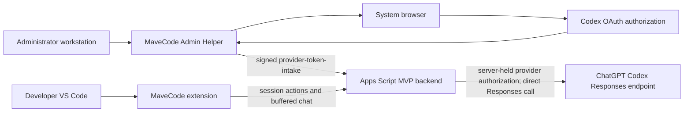
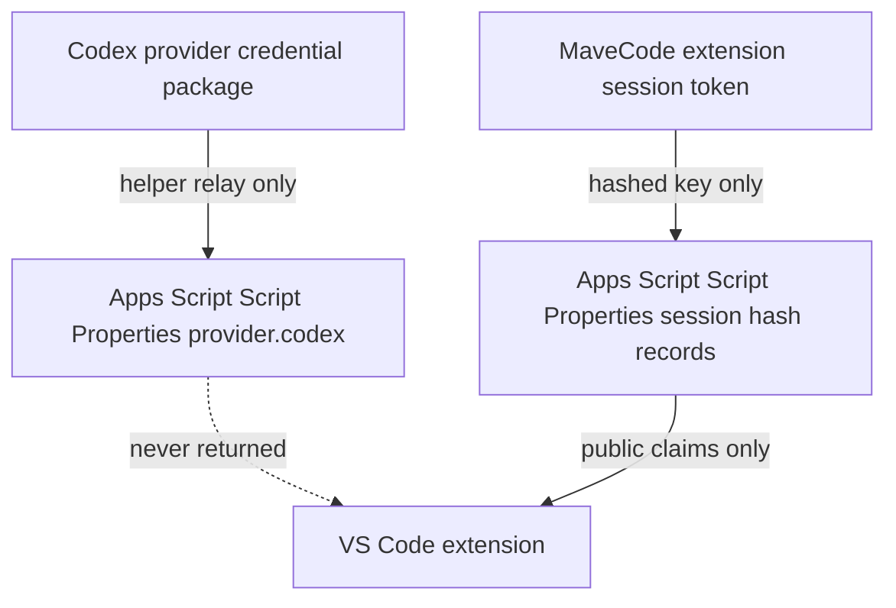

# MaveCode MVP architecture and trust boundaries

## Phase 1 implementation completion summary

Phase 1 implements a complete local-QA-validated MVP path from an administrator-controlled Codex authorization to a buffered MaveCode provider response inside the VS Code extension.

Implemented and locally validated:

- Loopback-only MaveCode Admin Helper with PKCE, OAuth state validation, signed token relay, backend URL allowlisting, CORS minimization, payload limits, redaction, logout, and no token-export route.
- Apps Script MVP backend with `health`, `provider-token-intake`, `provider-status`, `provider-revoke`, `session-issue`, `session-verify`, `session-refresh`, `session-revoke`, `models`, and buffered `chat` actions.
- Extension Secret Storage session lifecycle, Apps Script action client, MaveCode provider adapter, managed model catalog fetch, buffered chat mapping, tool-call continuation support, error normalization, and limited pre-dispatch cancellation.
- Mock-only local E2E coverage across helper, Apps Script, and extension transport behavior.
- Sanitized-path release runner and VSIX packaging, producing [`../bin/mave-code-3.76.0.vsix`](../bin/mave-code-3.76.0.vsix).

Not completed by code/local QA alone:

- Private Codex/OAuth client registration and provider approval.
- Private Apps Script deployment credentials and deployment URL.
- Credentialed deployment smoke test against a real Apps Script deployment, real helper, real VSIX, and real provider authorization.
- Production terms/compliance review for the intended provider authorization pattern.

## Component view



## Trust boundaries

| Boundary | Trusted side | Less-trusted side | Control |
| --- | --- | --- | --- |
| Administrator local helper to browser | Helper process and administrator account | Browser redirects and localhost requests | PKCE, one-time state, loopback binding, no token export |
| Helper to Apps Script | Helper with private intake secret | Public web-app endpoint | HMAC over timestamp, nonce, and raw body digest; timestamp window; replay cache |
| Extension to Apps Script | Apps Script session issuer and Script Properties | Developer extension client | Short-lived opaque MaveCode session token, active Google identity matching, allowlist |
| Apps Script to provider runtime | Apps Script Script Properties | Provider network/runtime | Bearer provider authorization held server side; no credential return actions |
| Extension to local tools | User approvals and VS Code extension host | Model output | Local agent loop remains in extension; backend does not execute filesystem or terminal actions |

## Credential and session separation



- Provider credentials are accepted only by the HMAC-protected intake action.
- Provider credentials are never returned by health, provider status, models, session, or chat actions.
- Extension sessions use the `mave_ext_` prefix and are stored in VS Code Secret Storage.
- Session records are stored under hashed keys in Apps Script and contain only subject, role, issue time, expiry, and refresh window.
- The helper intake secret is shared only between the private helper configuration and Apps Script Script Properties.

## MVP protocol summary

The Apps Script backend uses an action-based JSON protocol with `protocolVersion` set to `mavecode.v1`.

| Action | Caller | Purpose |
| --- | --- | --- |
| `health` | Public GET or POST | Sanitized readiness and provider state |
| `provider-token-intake` | Admin helper | Signed Codex credential intake |
| `provider-status` | Admin identity or session | Sanitized provider connection status |
| `provider-revoke` | Admin identity | Delete provider authorization |
| `session-issue` | Verified active Google user | Issue extension session |
| `session-verify` | Same active user plus session | Verify session |
| `session-refresh` | Same active user plus refreshable session | Rotate extension session |
| `session-revoke` | Session owner or admin identity | Revoke extension session |
| `models` | Extension session | Return allowlisted model catalog |
| `chat` | Extension session | Buffered text/tool protocol request |

## HMAC intake boundary

The helper signs the exact JSON relay body. The signature input is:

```text
timestamp.nonce.sha256(rawBody)
```

Apps Script verifies:

- Timestamp is within `MAVECODE_MAX_SKEW_MS`.
- Nonce matches the configured format and has not been seen within `MAVECODE_NONCE_TTL_SECONDS`.
- HMAC-SHA-256 signature matches the shared `MAVECODE_INTAKE_SECRET`.
- Credential payload is for provider `codex` and includes a non-expired access token.

Because deployed Apps Script events do not reliably expose arbitrary headers, the helper sends `timestamp`, `nonce`, and `signature` in both headers and query parameters while keeping credentials only in the signed JSON body.

## Extension provider behavior

The `MaveCode` provider is implemented through the inherited gateway provider identifier `mave-gateway` and the user-facing label `MaveCode`. The extension stores:

- Apps Script backend URL in VS Code Secret Storage.
- MaveCode session token and expiry in VS Code Secret Storage.
- Provider profile settings for the MaveCode provider, including configured model ID and derived gateway base URL.

The extension does not store Codex access tokens, refresh tokens, ID tokens, helper intake secrets, Apps Script Script Properties, or provider account IDs.

