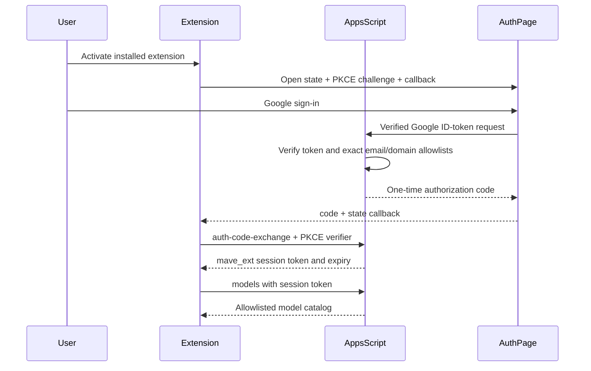

# MaveCode MVP deployment guide

This guide describes the first private deployment of the Phase 1 MVP. It intentionally uses placeholders. Do not commit real Apps Script URLs, OAuth client IDs, provider account IDs, session tokens, or secrets.

## Mandatory Google sign-in deployment

Deploy [`apps/mavecode-auth-page`](../apps/mavecode-auth-page) on HTTPS. Copy its `config.example.js` to an untracked `config.js`, set the public Apps Script deployment URL and Google Web OAuth client ID, and register the final static-site origin under **Authorized JavaScript origins** in Google Cloud Console. For Blogger **Theme → Edit HTML**, use the single-file [`blogger-theme.xml`](../apps/mavecode-auth-page/blogger-theme.xml) and follow its [`README`](../apps/mavecode-auth-page/README.md). The regular [`blogger-standalone.html`](../apps/mavecode-auth-page/blogger-standalone.html) is not Blogger Theme XML and causes a SAX parser error when pasted there. Blogger cannot provide the original page's strict CSP and therefore expands the browser-side trust boundary.

Build/package the extension with `MAVE_CODE_AUTH_PAGE_URL` set to the deployed page and `MAVE_CODE_BACKEND_URL` set to the Apps Script `/exec` URL. Set `MAVECODE_ALLOWED_USERS` and `MAVECODE_ALLOWED_DOMAINS` independently. Email entries grant exact addresses; domain entries grant every verified Google account whose normalized email uses that exact domain. Keep `MAVECODE_ENABLE_LEGACY_SESSION_ISSUE` unset in production.

Extension activation has no inherited cloud-service import or initialization path. It does not start inherited web authentication, settings synchronization, task sharing, telemetry transport, retry queues, or inherited cloud network requests. A temporary internal compatibility module remains packaged only for local schema and non-startup call-site compatibility while those interfaces are removed incrementally.

## Prerequisites

- Windows, macOS, or Linux workstation for building the repository.
- Node matching the repository engine when available. The current package declares Node `22.23.1`; prior release QA passed with Node `22.15.0` and non-fatal engine warnings.
- Corepack-enabled `pnpm` matching [`../package.json`](../package.json), currently `pnpm@10.8.1`.
- VS Code with CLI command `code` available for VSIX install, or another compatible editor CLI.
- Google account or Workspace account authorized to create and deploy Apps Script web apps.
- `clasp` if using command-line Apps Script deployment. Manual upload is also supported.
- A private Codex/OAuth client registration that supports the exact loopback redirect used by the helper.
- Apps Script outbound access to the fixed ChatGPT Codex Responses endpoint.
- Provider terms and security approval for the intended Codex authorization pattern before multi-user use.

## Build prerequisites and local install

From the repository root:

```powershell
corepack enable
pnpm install --frozen-lockfile
pnpm check-types
```

The built Phase 1 VSIX is [`../bin/mave-code-3.76.0.vsix`](../bin/mave-code-3.76.0.vsix). To rebuild it from a sanitized path, use:

```powershell
pnpm release:sanitized
```

## Configure the Codex OAuth client

Register a private OAuth client using the provider-approved process. Use placeholders in documentation and issue trackers only.

Required registration values:

| Setting | Placeholder example | Notes |
| --- | --- | --- |
| Client ID | `replace-with-your-registered-codex-client-id` | Store only in private helper configuration. |
| Redirect URI | `http://localhost:1455/auth/callback` | Must exactly match `MAVECODE_CODEX_REDIRECT_URI`; do not substitute `127.0.0.1`. |
| Scopes | `openid profile email offline_access` | Confirm currently permitted scopes with provider docs and terms. |
| Authorization endpoint | Provider-approved Codex authorization endpoint | Code currently uses the Codex OAuth endpoint in the helper. |
| Token endpoint | Provider-approved Codex token endpoint | Code currently exchanges authorization code with PKCE. |

Provider-terms caveat: the MVP validates the technical flow, not provider approval. Before sharing a provider authorization across users or teams, confirm that the OAuth client type, account use, token relay, quota model, and runtime endpoint comply with provider terms. If not approved, replace this flow with official API/project credentials or a supported per-user authorization flow.

## Configure and build the MaveCode Admin Helper

Package path: [`../apps/mavecode-admin-helper`](../apps/mavecode-admin-helper).

Create a private `.env` file from [`../apps/mavecode-admin-helper/.env.example`](../apps/mavecode-admin-helper/.env.example). Never commit it.

```dotenv
MAVECODE_CODEX_CLIENT_ID=replace-with-your-registered-codex-client-id
MAVECODE_CODEX_REDIRECT_URI=http://localhost:1455/auth/callback
MAVECODE_APPS_SCRIPT_URL=https://script.google.com/macros/s/replace-with-deployment-id/exec
MAVECODE_INTAKE_SECRET=replace-with-at-least-32-random-characters
MAVECODE_HELPER_PORT=1455
MAVECODE_STATE_TTL_MS=600000
MAVECODE_MAX_BODY_BYTES=16384
MAVECODE_TRUSTED_ORIGIN=
```

Important matching rules:

- `MAVECODE_CODEX_REDIRECT_URI` must be exactly registered as `http://localhost:1455/auth/callback`. The authorize request identifies the Codex flow with `codex_cli_simplified_flow=true` and `originator=mave-code`.
- The browser-facing redirect hostname is `localhost`, but the helper's actual listener remains pinned to `127.0.0.1`; do not expose it on a LAN address.
- `MAVECODE_APPS_SCRIPT_URL` must exactly match `https://script.google.com/macros/s/<deployment-id>/exec`; no query string, fragment, credentials, or alternate host.
- `MAVECODE_INTAKE_SECRET` must be the same high-entropy value stored in Apps Script Script Properties as `MAVECODE_INTAKE_SECRET`.

Helper commands:

```powershell
pnpm --filter @mavecode/admin-helper check-types
pnpm --filter @mavecode/admin-helper lint
pnpm --filter @mavecode/admin-helper test
pnpm --filter @mavecode/admin-helper build
node --env-file=apps/mavecode-admin-helper/.env apps/mavecode-admin-helper/dist/main.js
```

For development without a build:

```powershell
node --env-file=apps/mavecode-admin-helper/.env --import=tsx apps/mavecode-admin-helper/src/main.ts
```

Operational helper routes:

| Route | Purpose |
| --- | --- |
| `GET /health` | Non-sensitive helper readiness and relay status. |
| `GET /auth/start` | Start Codex OAuth PKCE in the system browser. |
| `GET /auth/callback` | Validate state, exchange code, and relay provider package. |
| `POST /configure` | Confirm configured Apps Script URL only; cannot change destination. |
| `POST /relay` | Re-send in-memory credential package. |
| `POST /logout` | Clear in-memory credentials and pending OAuth state. |

There is no helper route that returns raw tokens.

## Create the Apps Script project

Package path: [`../apps/mavecode-appscript`](../apps/mavecode-appscript).

1. Create a new Apps Script project in the approved Google account or Workspace.
2. Set the project name to `MaveCode MVP Backend` or an approved environment-specific name.
3. Build the package:

```powershell
pnpm --filter @mavecode/appscript test
pnpm --filter @mavecode/appscript lint
pnpm --filter @mavecode/appscript check-types
pnpm --filter @mavecode/appscript build
pnpm --filter @mavecode/appscript scan:secrets
```

4. Upload the built `dist` contents through `clasp` or manually through the Apps Script editor.

## Apps Script Script Properties

Set these in Apps Script **Project Settings → Script Properties**. Do not add them to tracked files or exported documentation.

| Property | Required | Purpose | Placeholder example |
| --- | --- | --- | --- |
| `MAVECODE_INTAKE_SECRET` | Yes | HMAC secret shared with helper. | `replace-with-at-least-32-random-characters` |
| `MAVECODE_ALLOWED_USERS` | Yes | Comma-separated lowercase extension users. | `developer@example.invalid` |
| `MAVECODE_ALLOWED_DOMAINS` | No | Comma-separated lowercase domains; authorizes every verified Google email at an exact listed domain. | `example.invalid` |
| `MAVECODE_ADMIN_USERS` | Yes | Comma-separated lowercase admins. | `administrator@example.invalid` |
| `MAVECODE_GOOGLE_CLIENT_ID` | Yes | Google Web OAuth client ID accepted by server-side ID-token verification. | `replace.apps.googleusercontent.com` |
| `MAVECODE_EXTENSION_CALLBACK_URI` | Yes | Exact extension callback URI bound to authorization codes. | `vscode://MaveCode.mave-code/auth-callback` |
| `MAVECODE_MODEL_ALLOWLIST` | Yes | Comma-separated provider model runtime IDs. | `configured-codex-model` |
| `MAVECODE_MAX_SKEW_MS` | No | HMAC timestamp skew window. | `300000` |
| `MAVECODE_NONCE_TTL_SECONDS` | No | HMAC nonce replay cache lifetime. | `600` |
| `MAVECODE_SESSION_TTL_MS` | No | Extension session token lifetime. | `900000` |
| `MAVECODE_REFRESH_TTL_MS` | No | Refreshable session window. | `3600000` |
| `MAVECODE_MAX_REQUEST_BYTES` | No | Max intake/chat request bytes. | `131072` |
| `MAVECODE_MAX_RESPONSE_BYTES` | No | Max provider response bytes. | `524288` |
| `MAVECODE_QUOTA_PER_MINUTE` | No | Per-subject chat quota. | `20` |

HMAC intake matching checklist:

- Helper `MAVECODE_INTAKE_SECRET` exactly equals Apps Script `MAVECODE_INTAKE_SECRET`.
- Helper sends action `provider-token-intake` and provider `codex`.
- Apps Script sees the exact raw JSON body used to compute `sha256(rawBody)`.
- `timestamp`, `nonce`, and `signature` arrive as query parameters or headers.
- Apps Script cache and lock services are available for replay prevention.

## Deploy with clasp

1. Copy [`../apps/mavecode-appscript/.clasp.json.example`](../apps/mavecode-appscript/.clasp.json.example) to a private `.clasp.json` inside [`../apps/mavecode-appscript`](../apps/mavecode-appscript).
2. Replace the placeholder script ID privately.
3. Authenticate `clasp` through your approved Google process.
4. Push the built files:

```powershell
pnpm --filter @mavecode/appscript build
cd apps/mavecode-appscript; clasp push
```

If your shell or policy prohibits changing directories in automation, run the equivalent `clasp push` from [`../apps/mavecode-appscript`](../apps/mavecode-appscript) in an approved terminal.

## Deploy manually

1. Run `pnpm --filter @mavecode/appscript build`.
2. In the Apps Script editor, create or replace files with the generated `dist` JavaScript and manifest contents.
3. Do not paste Script Properties into files.
4. Save and create a deployment version.

## Web app execute/access settings

Choose the narrowest settings that satisfy both helper intake and extension sessions in your Google Workspace environment.

Required behavior:

- Helper intake must be able to reach the deployed web-app URL.
- Browser sign-in must supply a Google ID token that Apps Script verifies for issuer, audience, expiry, verified email, and the independent email/domain allowlists.
- Extension bearer sessions do not depend on Apps Script active-user propagation after the one-time PKCE exchange.
- Non-allowlisted users must fail closed.
- Do not replace active Google identity with caller-supplied email.

Recommended validation matrix:

| Setting decision | Validate |
| --- | --- |
| Execute as deploying user | Provider credentials are protected by script ownership; active-user identity still resolves as expected. |
| Execute as accessing user | Script Properties remain available and admin/provider actions behave as expected. |
| Access restricted to organization | Users outside Workspace cannot issue sessions. |
| Anyone with link | Avoid unless required for helper intake and approved by security; HMAC still protects intake but session identity must be verified. |

## Redeployment and versioning

- Create a new Apps Script version for every deployment candidate.
- Keep the previous deployment ID and version available until smoke tests pass.
- Update helper `MAVECODE_APPS_SCRIPT_URL` and extension backend configuration only after the new deployment is ready.
- When changing Script Properties, record the change privately in the deployment runbook, not in Markdown.
- If rollback is needed, point helper and extension back to the previous web-app deployment URL and revoke any partially relayed provider authorization.

## Install the VSIX

The built VSIX is [`../bin/mave-code-3.76.0.vsix`](../bin/mave-code-3.76.0.vsix).

Install with VS Code CLI:

```powershell
code --install-extension bin/mave-code-3.76.0.vsix
```

Or use VS Code **Extensions → Install from VSIX** and select the artifact.

Verify identity:

- Extension ID: `MaveCode.mave-code`
- Package name: `mave-code`
- Display name: `MaveCode`

## Configure the MaveCode provider in the extension

1. Open MaveCode settings in VS Code.
2. Select API provider `MaveCode`.
3. Set the MaveCode backend URL to the private Apps Script web-app URL.
4. Sign in to MaveCode on the configured static Google page. Apps Script verifies the Google identity, returns a one-time PKCE-bound code, and the extension exchanges it for a session stored in VS Code Secret Storage.
5. Confirm the model list loads from `models` and choose an allowlisted model.
6. Save the provider profile.

Login/session flow:



## Step-by-step first deployment

1. Complete provider terms/security review for private MVP use.
2. Register Codex OAuth client with exact loopback redirect.
3. Generate `MAVECODE_INTAKE_SECRET` using an approved CSPRNG.
4. Build and test Apps Script package locally.
5. Create Apps Script project and upload built backend.
6. Add all required Script Properties.
7. Deploy the Apps Script web app and record the deployment URL privately.
8. Configure helper `.env` with Codex client ID, exact redirect URI, Apps Script URL, and intake secret.
9. Build and start the helper.
10. Open helper `/health` and confirm `backendConfigured` is true.
11. Open helper `/auth/start` and complete Codex authorization in the system browser.
12. Confirm helper relay succeeds and Apps Script `health` reports provider connected without credentials.
13. Install [`../bin/mave-code-3.76.0.vsix`](../bin/mave-code-3.76.0.vsix).
14. Configure MaveCode provider with the private Apps Script URL.
15. Sign in, load models, select the allowlisted model, and run a text chat.
16. Run the deployment smoke-test checklist in [`security-and-threat-model.md`](security-and-threat-model.md).
17. Record results privately; do not paste secrets or deployment IDs into repository docs.

## Operator task handoff: Blogger deployment

Complete these tasks in order. After each task, retain the requested non-secret output for the next configuration step.

1. **Create the dedicated Blogger property.** Use a new blog/property with no ads, analytics, third-party widgets, comments, or unrelated content. The authentication surface will replace its entire theme. Output: provisional canonical HTTPS blog URL.
2. **Create a Google Cloud project and OAuth consent screen.** Configure the app name and support/developer contact. If the app is External and in testing, add every allowed Google account as a test user. Output: project ID only.
3. **Create a Web application OAuth client.** Add the Blogger origin only—for example `https://your-blog.blogspot.com`—to **Authorized JavaScript origins**. Do not add the VS Code callback as a web redirect URI. Output: Web client ID.
4. **Generate the helper intake secret locally.** Use an approved password manager or CSPRNG to generate at least 32 random bytes. Store it privately; never send it in chat or commit it. Output: confirmation that it was stored, not its value.
5. **Create and upload Apps Script.** Build [`apps/mavecode-appscript`](../apps/mavecode-appscript), create a new Apps Script project, upload the generated `dist` files, and add the Script Properties from this guide. Output: confirmation and the selected exact email/domain/model lists, excluding secrets.
6. **Deploy Apps Script as a Web app.** Use **Execute as: Me** and the narrowest access setting that still allows the Blogger page and helper to call the web app. Because Google ID tokens are verified by the backend, deployments that must serve external allowed accounts generally require the web app to be reachable by those callers. Output: `/exec` deployment URL.
7. **Replace the Blogger theme.** In [`blogger-theme.xml`](../apps/mavecode-auth-page/blogger-theme.xml), replace only `REPLACE_WITH_DEPLOYMENT_ID`; the public Google client ID is already configured. Open **Blogger → Theme → Edit HTML**, select all existing text, paste the complete XML with its declaration as the very first bytes (no BOM, whitespace, or comment before it), and click **Save**. Never paste [`blogger-standalone.html`](../apps/mavecode-auth-page/blogger-standalone.html) into this editor: it is regular HTML, while Blogger parses themes as XML and rejects it with a SAX error before the root element. Inspect published source to verify Blogger retained the Google script and `auth-google-complete` logic. Output: final page URL and confirmation that query parameters are preserved.
8. **Configure and run the admin helper.** Put the Apps Script URL, private intake secret, approved Codex client ID, and exact loopback redirect in the helper's untracked `.env`. Complete provider authorization and verify relay success. Output: sanitized `/health` result only.
9. **Build the production VSIX.** Set `MAVE_CODE_AUTH_PAGE_URL` to the Blogger page and `MAVE_CODE_BACKEND_URL` to Apps Script before bundling. Install the rebuilt VSIX; older artifacts do not contain these deployment values. Output: VSIX SHA-256.
10. **Run acceptance tests.** Verify allowed exact email, allowed domain, denied account, callback return, model loading, chat, session refresh, sign-out, and provider revocation. Record results without tokens or request bodies.

## Rollback and upgrade

Rollback:

- Reinstall the previous VSIX if extension behavior regresses.
- Point extension backend URL to the previous Apps Script deployment.
- Point helper `MAVECODE_APPS_SCRIPT_URL` to the previous Apps Script deployment.
- Revoke provider authorization in the problematic deployment.
- Rotate `MAVECODE_INTAKE_SECRET` if the failed deployment exposed it.

Upgrade:

- Build and validate from a sanitized path with `pnpm release:sanitized`.
- Deploy Apps Script as a new version and smoke-test with a small allowlist.
- Install the new VSIX on an administrator test workstation before broad rollout.
- Preserve compatibility with existing `mavecode.v1` action responses until the production gateway introduces a staged protocol migration.

