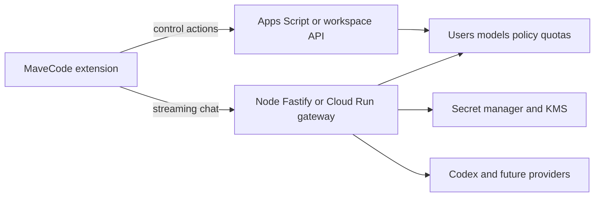

# Apps Script limitations and production migration plan

## MVP limitations

The Apps Script backend is intentionally an MVP bridge, not the permanent inference data plane.

| Limitation | Effect |
| --- | --- |
| `UrlFetchApp` buffers responses | The extension receives completed buffered responses, not token-by-token streaming. |
| Weak in-flight cancellation | Aborting before dispatch works; after Apps Script starts `UrlFetchApp`, cancellation only stops local waiting. |
| Execution duration limits | Long agent runs can exceed Apps Script runtime limits. |
| Response size limits | Large model outputs can hit `MAVECODE_MAX_RESPONSE_BYTES` or Apps Script platform limits. |
| Concurrency quotas | Multiple users can exhaust Apps Script execution or lock capacity. |
| Cache semantics | Replay and quota caches are bounded and not durable databases. |
| Script Properties | Useful for MVP configuration but not managed-key credential storage. |
| Observability limits | Apps Script logs are not a complete structured tracing platform. |

## Production target

Move the inference path to a streaming Node/Fastify or Cloud Run gateway while keeping the extension and control plane compatible during migration.

Recommended production gateway capabilities:

- SSE or chunked streaming with normalized `mavecode.v1` events.
- Request cancellation propagated to provider clients.
- Managed secret storage with KMS encryption.
- Provider token refresh with distributed locking.
- Per-user, per-organization, per-model rate limits and concurrency controls.
- Idempotency keys for safely replayable requests.
- Structured logs with request IDs and credential/prompt redaction.
- Metrics for latency, usage, provider errors, quota events, and cancellation.
- Circuit breakers and bounded retries.
- Provider error normalization compatible with the existing extension adapter.

## Staged compatibility plan

### Stage 0 — Current MVP

- Extension uses Apps Script action protocol for sessions, models, and buffered chat.
- Protocol version is `mavecode.v1`.
- Apps Script stores provider authorization in Script Properties.

### Stage 1 — Gateway in shadow mode

- Deploy gateway with no user traffic.
- Mirror model catalog and policy from Apps Script or a private config source.
- Validate provider authorization storage in a managed secret store.
- Run synthetic streaming tests with placeholder/test prompts only.

### Stage 2 — Dual endpoint configuration

- Keep Apps Script for sessions, models, and admin control.
- Add an optional streaming chat endpoint to the extension/provider configuration.
- Preserve Apps Script buffered chat as fallback.
- Validate identical model IDs and normalized error codes.

### Stage 3 — Limited streaming rollout

- Enable streaming endpoint for administrators and a small allowlist.
- Compare buffered and streaming behavior for multi-turn and tool-call continuation.
- Validate cancellation propagation and provider timeout handling.
- Monitor quota, latency, and redaction.

### Stage 4 — Production gateway default

- Make gateway the default chat path.
- Keep Apps Script as control plane if it remains sufficient.
- Preserve `mavecode.v1` compatibility or provide a negotiated protocol upgrade.
- Keep rollback to Apps Script buffered chat until confidence is established.

### Stage 5 — Control-plane migration

- Move sessions, policy, models, audits, and organization management to a dedicated backend if Apps Script becomes limiting.
- Retire provider credentials from Script Properties.
- Retain Apps Script only for emergency admin operations or remove it entirely.

## Rollback strategy during migration

- Feature-flag the streaming endpoint independently from the MaveCode provider entry.
- Keep Apps Script buffered chat available during initial gateway rollout.
- Keep previous gateway revision deployable.
- Use stable model IDs across both paths.
- Preserve extension compatibility with `mavecode.v1` responses.
- On incident, disable streaming, route chat back to Apps Script, revoke suspect provider credentials, and rotate secrets if needed.

